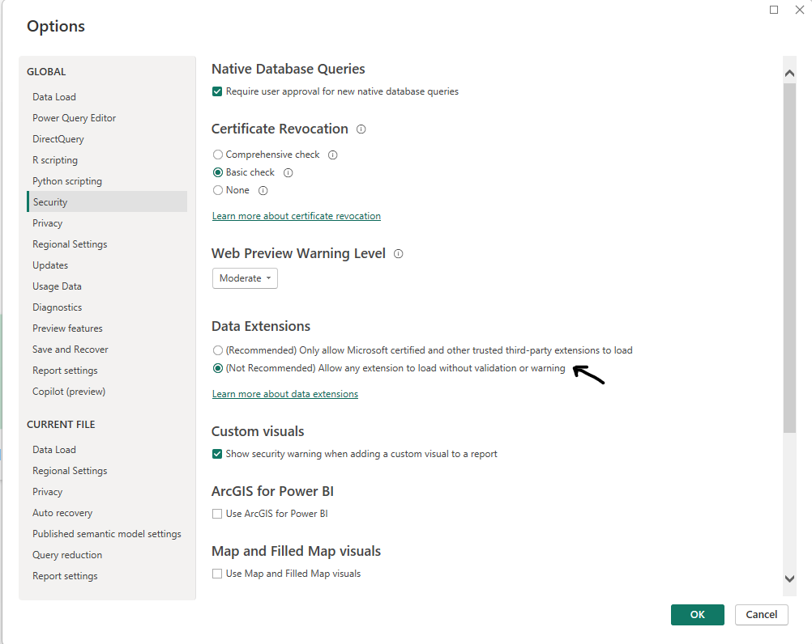
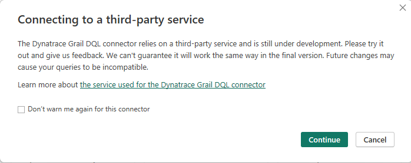
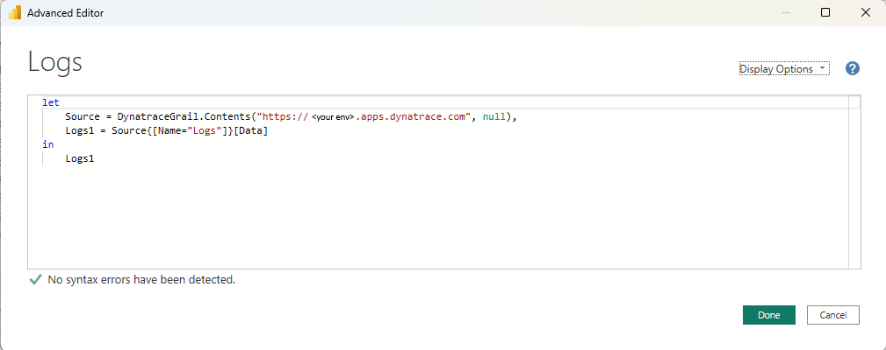
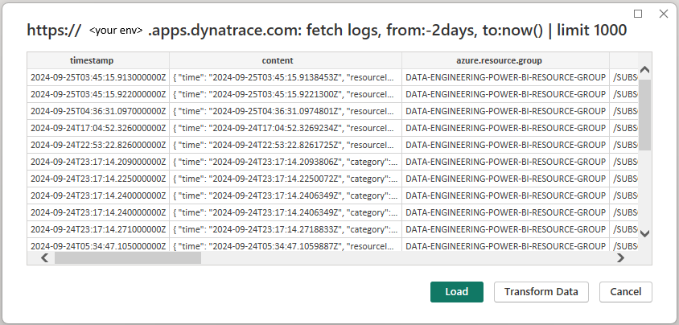

# Microsoft documentation to connect PowerBI to Dynatrace Grail.

The following connector article is provided by Dynatrace, the owner of
this connector and a member of the Microsoft Power Query Connector
Certification Program. If you have questions regarding the content of
this article or have changes you would like to see made to this article,
visit the Dynatrace website and use the support channels there.

|Item|                                Description|
------|----------------------------------------------------------------
|Release State|                       Pre-Release|
|Products|                            PowerBI (Semantic Models)|
|Authentication Types Supported|      Windows (Power BI Desktop)|
|Function Reference Documentation|    Source|

## Prerequisites

### Dynatrace environment

It is assumed that a Dynatrace environment is already configured for
connection from PowerBI Desktop.

On Microsoft Azure that can be done through the Marketplace and
searching for: **Azure Native Dynatrace Service**

Follow the instruction to set up a Dynatrace SaaS environment and make
sure the environment is set to the new version and not previous classic
as the latest version contains a Grail data lakehouse and is set up for
the authentication requirements for the connector.

### Setting up the connector

Please follow the steps below to set up the Dynatrace Grail DQL
Connector for the Power BI Desktop.

Installing the MEZ file requires lowering security on PowerBI Desktop.
To achieve the same without lowering the security you would need the
"Dynatrace Grail DQL.pqx" file and the registry thumbprint which is
available on request from Dynatrace.

1.  Copy the connector file ("Dynatrace Grail DQL.mez") to the folder
    \\Documents\\Power BI Desktop\\Custom Connectors. Create folders if
    needed.

2.  In Power BI Desktop, go to Options. On the Security tab, change Data Extensions to Not Recommended, as in the picture below.
   

--------------------------------------------------------
## Capabilities Supported

| Number | Capability                                  |
| ------ | ------------------------------------------- |
| 1      | Import mode only                            |
| 2      | Option to enter a DQL query when connecting - limited to a maximum of 1 million rows. |
--------------------------------------------------------

## Connection to Dynatrace Grail from PowerBI Desktop

To connect to a Dynatrace SaaS instance from Power Query Desktop, take
the following steps:

1) Select **Dynatrace Grail DQL** in the get data experience.
   

2) While the connector is being certified you will need to accept this notification of a 3rd party service.

3) Enter your Dynatrace environment. Note that this needs to be the latest Dynatrace version with Grail enabled. The DQL query is optional at this point, but should be used for more complex queries outside of the default queries built in.

4) The next screen will require you to sign into your environment to authenticate your permissions.

5) A browser window will pop up requiring your credentials.

6) Once you have successfully authenticated, the message will show that you are currently signed in.Click Connect.

7) The Navigator screen will show the record types available to select from Dynatrace Grail.

8. Selecting one of them, Logs in this example, will run a fetch logs DQL query with a default 1000 row limit. Note that you will require permissions on the Dynatrace environment in order to be able to run this query successfully.

1) The Advanced Editor shows the M code the connector is using.

10)  An optional step when connecting is to type in a DQL query directly. In this example fetch logs (default last 2 hours) with a limit of 1000 rows.

11) The resulting import into PowerBI will look similar to this.

### Troubleshooting

-   The latest version ("New" not "Classic") of Dynatrace SaaS is
    required.

-   The correct permissions outlined in [Dynatrace
    documentation](https://docs.dynatrace.com/docs/platform/grail/data-model/assign-permissions-in-grail)
    are required to be able to:

    -   Connect to the environment

    -   Run DQL queries against the Dynatrace platform
